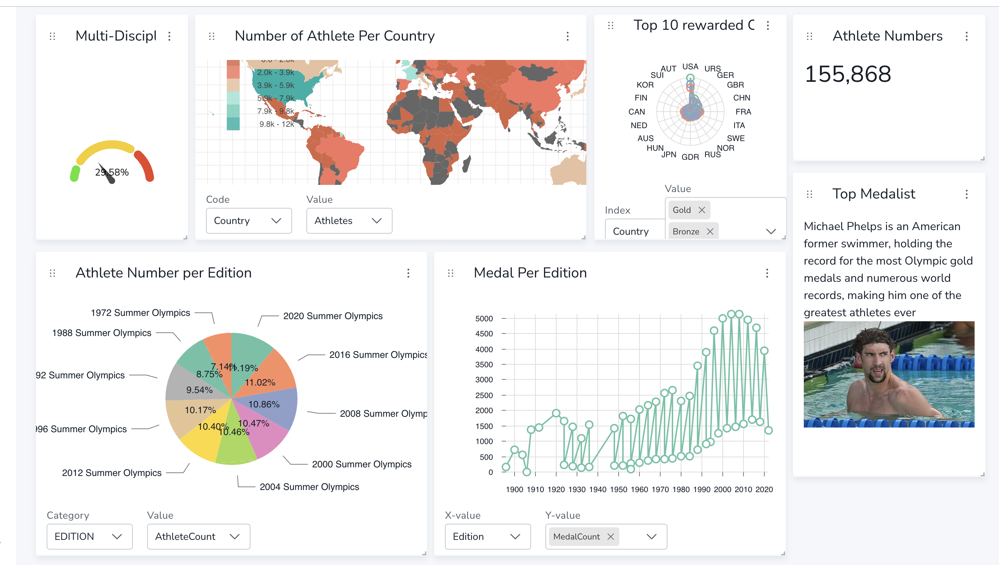

# OLYMPIC GAMES DATA BASE MODELISATION
This project leverages Neo4j to analyze the Olympic Games dataset, focusing on relationships between athletes, countries, sports, editions, and medals. By incorporating social data like tweets, it offers insights into the dynamics and impact of the Games through innovative visualizations and analyses



 Preprocessing was performed to facilitate data import, ensuring seamless integration and exploration. The necessary command for importing the data is provided below :
 
 ```
./bin/neo4j-admin database import full \   
--nodes=athlete=/home/deptinfo/Downloads/data_jo1/athlete_header.csv,/home/deptinfo/Downloads/data_jo1/athlete.csv \
--nodes=pays=/home/deptinfo/Downloads/data_jo1/pays_header.csv,/home/deptinfo/Downloads/data_jo1/pays.csv \
--nodes=medaille=/home/deptinfo/Downloads/data_jo1/medaille_header.csv,/home/deptinfo/Downloads/data_jo1/medaille.csv \
--nodes=edition=/home/deptinfo/Downloads/data_jo1/edition_header.csv,/home/deptinfo/Downloads/data_jo1/edition.csv \
--nodes=sport=/home/deptinfo/Downloads/data_jo1/sport_header.csv,/home/deptinfo/Downloads/data_jo1/sport.csv \
--nodes=discipline=/home/deptinfo/Downloads/data_jo1/discipline_header.csv,/home/deptinfo/Downloads/data_jo1/discipline.csv \
--relationships=Represente=/home/deptinfo/Downloads/data_jo1/Represente_header.csv,/home/deptinfo/Downloads/data_jo1/Represente.csv \
--relationships=A_obtenu=/home/deptinfo/Downloads/data_jo1/A_obtenu_header.csv,/home/deptinfo/Downloads/data_jo1/A_obtenu.csv \
--relationships=Obtient=/home/deptinfo/Downloads/data_jo1/Obtient_header.csv,/home/deptinfo/Downloads/data_jo1/Obtient.csv \
--relationships=Participe=/home/deptinfo/Downloads/data_jo1/Participe_header.csv,/home/deptinfo/Downloads/data_jo1/Participe.csv \
--relationships=Contient=/home/deptinfo/Downloads/data_jo1/contient_header.csv,/home/deptinfo/Downloads/data_jo1/contient.csv \
--relationships=Sedivise=/home/deptinfo/Downloads/data_jo1/sedivise_header.csv,/home/deptinfo/Downloads/data_jo1/sedivise.csv \
--relationships=Compete=/home/deptinfo/Downloads/data_jo1/Compete_header.csv,/home/deptinfo/Downloads/data_jo1/Compete.csv \
--trim-strings=true --multiline-fields=true --skip-duplicate-nodes=true --overwrite-destination neo4j --verbose
```


